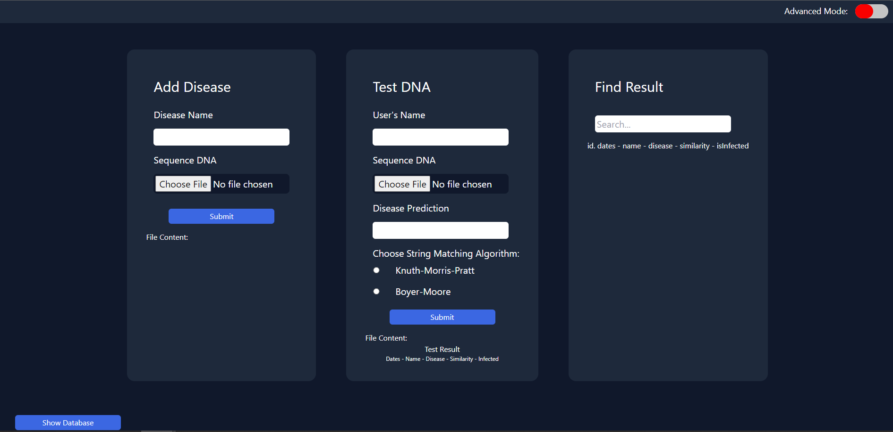

# DNA Pattern Matching using String Matching and Regular Expression 

## Table of Contents
- [General Information](#general-information)
- [Requirements](#requirement)
- [How To Build](#how-to-build)
- [How To Run](#how-to-run)
- [Usage](#usage)
- [Authors](#authors)

## General Information
Project website dna tester ini dibuat untuk memenuhi tugas besar 3 mata kuliah IF2211 Strategi Algoritma. Website dibuat menggunakan ReactJS sebagai front end dan NodeJs sebagai back end. Basis data menggunakan PostgreSQL yang dimuat di layanan Heroku.
Algoritma yang digunakan pada project ini adalah Knuth-Morris-Pratt dan Boyer-Moore untuk String Matching, algoritma Longest Common Subsequence untuk menghitung tingkat similaritas, serta Regular Expression untuk filter pada pencarian dan sanitasi input.

Front end website dideploy menggunakan layanan Netlify dan back end website dideploy menggunakan layanan Heroku.
- https://dna-tester.netlify.app/
- https://dna-tester.herokuapp.com/




## Requirement
- [Node.js](https://nodejs.org/en/download/)
- [npm](https://docs.npmjs.com/downloading-and-installing-node-js-and-npm)

## How To Build and Run
1. Clone repository ini. 
    ```
    https://github.com/Putriliza/Tucil3_13520066.git
    ```
2. Buka 2 terminal di direktori repository yang sudah diclone
3. Untuk menjalankan back end, jalankan perintah berikut
    ```
    cd src/server
    npm install
    nodemon start
    ```
    Back end akan dijalankan pada port 3001. http://localhost:3001/
4. Untuk menjalankan front end, jalankan perintah berikut
    ```
    cd src/client
    npm install
    npm start
    ```
    Front end akan dijalankan pada port 3000. http://localhost:3000/

## Usage
1. Fitur Add Disease
    - Input nama penyakit (penyakit yang diterima adalah penyakit baru yang belum ada di database)
    - Input sequence DNA penyakit (valid jika hanya mengandung A, C, G, T)
    - Klik tombol submit
2. Fitur Test DNA
    - Input nama pengguna
    - Input sequence DNA pengguna (valid jika hanya mengandung A, C, G, T)
    - Input nama penyakit yang ingin ditest
    - Pilih algoritma string matching yang diinginkan
    - Klik tombol Submit
    - Hasil test akan ditampilkan ke layar
3. Fitur Find Result
    - Input terms pencarian
    - Pengguna dapat memberi masukan berupa:
        ```
        - <tanggal_prediksi> <spasi> <nama_penyakit>
        - <nama_penyakit> <spasi> <tanggal_prediksi>
        - <tanggal_prediksi>
        - <nama_penyakit>
        ```
    - Format tanggal:
        ```
        - dd-mm-yyyy
        - dd/mm/yyyy
        - dd month yyyy
        - yyyy-mm-dd
        - yyyy/mm/dd
        - yyyy month dd
        ```
4. Disediakan toggle switch jika ingin input sequence DNA tanpa upload file
5. Klik button ```Show Database``` untuk melihat isi database

## Authors

<b>Kelompok ApaYa</b>
| NIM       | Name                      |
| --------- | --------------------------|
| 13520002  | Muhammad Fikri Ranjabi    |
| 13520051  | Flavia Beatrix Leoni A. S.|
| 13520066  | Putri Nurhaliza           |

TUGAS BESAR 3 - Strategi Algoritma

Bandung Institute of Technology